# Modul 141
> LB3 ->[LB3.md](lb3/LB3.md)
# Tag 1 
Heute haben Ich die Lokale Umgebung bereitgestellt.

Dafür mussten wir folgende Sachen machen
- [x] **Xampp Installieren**
- [x] **Systemvariable hinzufügen**
    Dafür musste ich nur in die Systemvariablen gehen, dort auf Path drücken, und eine neue Pfad-Variable hinzufügen. 
    

- [x] **Mysql Benutzer Anlegen**
    Für den Benutzer musste ich mich als root ins mysql anmelden und einen neuen Benutzer anlegen, und rechte vergeben, und schlussendlich habe ich die Systemvariable, und den neuen Benutzer gleichzeitig probiert und es hat funktioniert.
    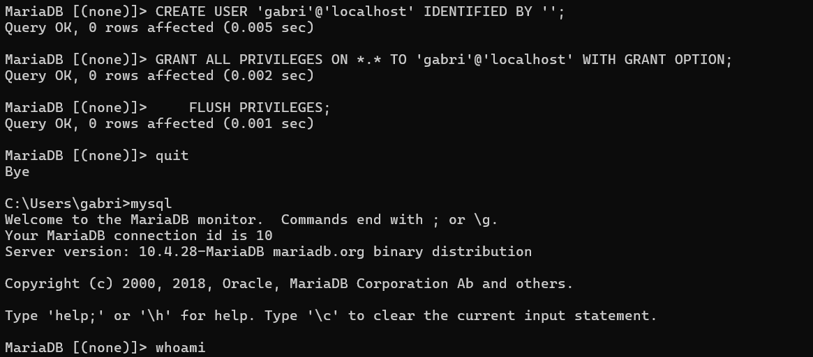
## Task 1
| **Produkt**        | **Merkmale**                      | **Vorteile**              | **Nachteile**                    | **Anwendungsfälle**              |
| ------------------ | --------------------------------- | ------------------------- | -------------------------------- | -------------------------------- |
| **MariaDB**        | MySQL-kompatibel, Open Source     | Schnell, lizenzfrei       | Weniger kommerzielle Tools       | Webanwendungen, Open Source      |
| **MySQL (Oracle)** | Weit verbreitet, einfache Nutzung | Viele Tools, bekannt      | Kommerzielle Nutzung kostet      | LAMP-Stacks, CMS                 |
| **MS-SQL**         | Microsoft, proprietär             | Gute Windows-Integration  | Lizenzkosten, kaum Linux-Support | ERP, CRM, Business-Anwendungen   |
| **PostgreSQL**     | Sehr zuverlässig, erweiterbar     | Stark bei komplexen Daten | Höhere Lernkurve                 | Wissenschaft, Geodaten (PostGIS) |
## Task2
| **Datenbankmodell** | **Produkt(e)**       | **Vor-/Nachteile**                                                                                               | **typ. Anwendungen**                              | **Bild, Bsp, Link, etc**                             |
| ------------------- | -------------------- | ---------------------------------------------------------------------------------------------------------------- | ------------------------------------------------- | ---------------------------------------------------- |
| **Document**        | MongoDB              | ✅ Flexibles Schema, gut skalierbar<br>❌ Schwächer bei komplexen Joins                                            | CMS, E-Commerce, JSON-APIs                        | [mongodb.com](https://www.mongodb.com)               |
| **Key-Value**       | Redis                | ✅ Extrem schnell, ideal für Cache<br>❌ Datenstruktur begrenzt                                                    | Caching, Sessions, Echtzeit-Statistiken           | [redis.io](https://redis.io)                         |
| **Wide Column**     | Apache Cassandra     | ✅ Hohe Schreiblast, skalierbar<br>❌ Komplex bei Queries, eingeschränkte Joins                                    | IoT, Zeitreihen, Logging                          | [cassandra.apache.org](https://cassandra.apache.org) |
| **Search**          | Elasticsearch        | ✅ Leistungsstarke Volltextsuche<br>❌ Ressourcenintensiv, komplexes Setup                                         | Logs, Website-Suche, Monitoring                   | [elastic.co](https://www.elastic.co)                 |
| **Graph**           | Neo4j                | ✅ Ideal für Beziehungen & Netzwerkstrukturen<br>❌ Eingeschränkte Skalierbarkeit bei großen Graphen               | Social Media, Empfehlungssysteme, Fraud Detection | [neo4j.com](https://neo4j.com)                       |
| **Time Series**     | InfluxDB             | ✅ Hohe Ingest-Leistung, speziell für Zeitdaten<br>❌ Weniger relational, hoher Speicherbedarf bei hoher Auflösung | Monitoring, Sensoren, IoT                         | [influxdata.com](https://www.influxdata.com)         |
| **Spatial**         | PostGIS (PostgreSQL) | ✅ Mächtig bei Geodaten, SQL-basiert<br>❌ Komplexer Einstieg, GIS-Wissen erforderlich                             | GIS, Karten, Standortdatenanalyse                 | [postgis.net](https://postgis.net)                   |

# Tag 2
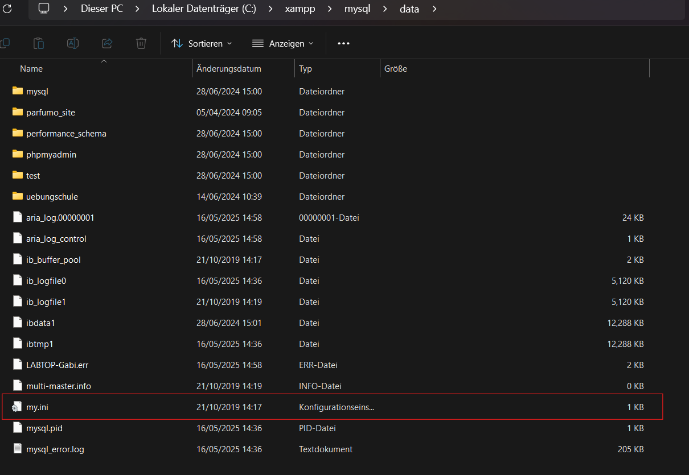


# Tag 3
- Ändern Sie in der Datenbank hotel den Typ der Tabelle benutzer zu InnoDB.
    ``ALTER TABLE benutzer ENGINE = InnoDB;``
    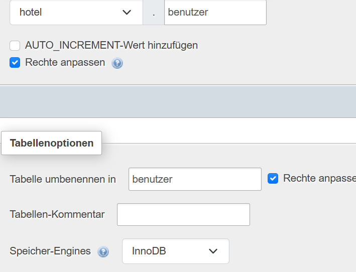


- Lassen Sie sich den Typ jeder Tabelle anzeigen. Kontrollieren Sie, dass die Tabelle benutzer  das Format InnoDB hat.
    ```
    SELECT TABLE_NAME, ENGINE
    FROM information_schema.TABLES
    WHERE TABLE_SCHEMA = 'hotel';
    ```
    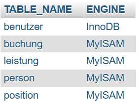
 

- Geben Sie Werte ein und kontrollieren Sie die Veränderungen in Ihrem data-Verzeichnis und in dem Verzeichnis der Datenbank hotel.
    `SHOW VARIABLES LIKE 'datadir';`
    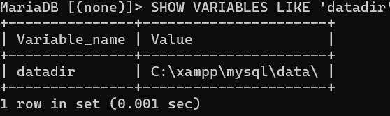
    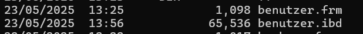
- Kontrollieren Sie die Dateien in der Dateiordnerstruktur des Datenbank-Verzeichnisses.


## Transactions
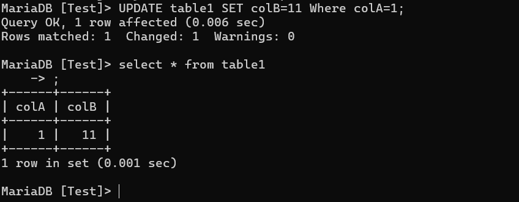
Hier habe ich mit `Begin;` die Transaktion gestartet, und dann einen Wert aktualiserit, 
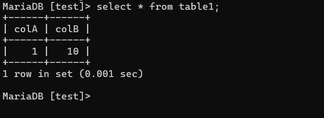
Bei **Client B** hat sich es noch nicht aktualiseirt, da die Transaction noch nicht commited worden ist.

Danach habe ich auf **Client B** eine Transaction gestartet, und versucht ein Wert zu aktualisieren, jedoch ging es nicht da die Transaction auf **Client A** noch am laufen war.
Dan habe ich die transaction auf **Client A** beendet, und dann auf **Client B** das updaten des Wertes nochmals gemacht, und es hat funktioniert, auf **Client A** ist immernoch 11, während auf **Client B** der Wert schon auf 14 ist

Nachdem habe ich ``ROLLBACK``; verwendet, und der wert ist auf 11 zurück gegangen.

---

Locking-Mechanismen |Bereich (Level) - Sperrung von ... |
| --------- | ------------|
|MyISAM | Table-Level-Locking - ganze Tabelle |
| BDB | Page-Level-Locking - Speicherseite |
| Gemini |Page-Level-Locking – Speicherseite |
| InnoDB | Row-Level-Locking - Datensatz |
## Locking
Ich habe eine Tabelle mitarbeiter stellt, und dort daten eingefügt, ich habe dann die Tabelle mit ``LOCK TABLES mitarbeiter WRITE;`` gesperrt und versucht in der **Konsole B** die Daten zu ausschreiben, jedoch passiert nichts und ich musste es slebst abbrechen. (MyISAM)
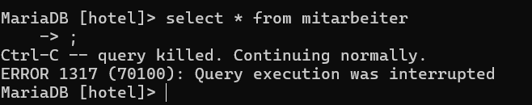

### Transaction Locking
Wenn ich jetzt eine transaction starte und ein Select * from mit dem parameter ``for update`` mache, ist es auch blockiert
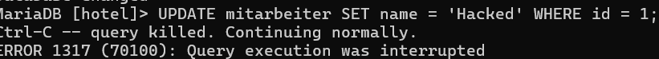

| Sperrtyp                 | Befehl                           | Engine | Sperrbereich       | Blockiert was?                          | Bemerkung                                 |
| ------------------------ | -------------------------------- | ------ | ------------------ | --------------------------------------- | ----------------------------------------- |
| **Table Lock (WRITE)**   | `LOCK TABLE tabelle WRITE;`      | MyISAM | Ganze Tabelle      | SELECT, UPDATE, DELETE anderer Sessions | Nur bei MyISAM sinnvoll/nötig             |
| **Table Lock (READ)**    | `LOCK TABLE tabelle READ;`       | MyISAM | Ganze Tabelle      | UPDATE, DELETE anderer Sessions         | Mehrere Leser möglich, keine Schreiber    |
| **Row Lock (Exclusive)** | `SELECT ... FOR UPDATE;`         | InnoDB | Ausgewählte Zeilen | UPDATE, DELETE dieser Zeilen            | Nur innerhalb Transaktion, für Änderungen |
| **Row Lock (Shared)**    | `SELECT ... LOCK IN SHARE MODE;` | InnoDB | Ausgewählte Zeilen | UPDATE, DELETE dieser Zeilen            | Lesen erlaubt, schützt vor Änderungen     |
| **Implizites Locking**   | `INSERT / UPDATE / DELETE`       | InnoDB | Betroffene Zeilen  | Andere Änderungen auf dieselben Zeilen  | Automatisch durch InnoDB                  |
| **Sperre auf Metadaten** | z. B. `ALTER TABLE`              | alle   | Ganze Tabelle      | Alle Zugriffe                           | Temporär bei Strukturänderungen           |

---
# Tag 4
## Security 
**Benutzer**
```sql
CREATE USER 'user_local'@'localhost' IDENTIFIED BY 'pass_local';
CREATE USER 'user_remote1'@'192.168.1.100' IDENTIFIED BY 'pass_remote1';

-- Remote Benutzer mit beliebiger IP
CREATE USER 'user_remote2'@'%' IDENTIFIED BY 'pass_remote2';

-- Benutzer mit Hostname
CREATE USER 'user_host'@'myhost.domain.local' IDENTIFIED BY 'pass_host';
```
```sql
SELECT User, Host, authentication_string FROM mysql.user;
```
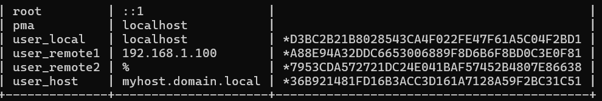
___ 
```sql
SELECT * FROM mysql.global_priv;
```
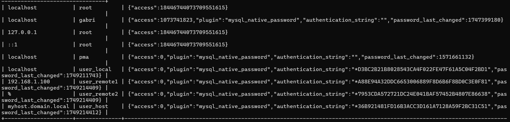

# Von localhost:
mysql -u user_local -p -h 127.0.0.1   # geht
mysql -u user_remote2 -p -h 127.0.0.1 # geht NICHT
mysql -u user_remote1 -p -h 127.0.0.1 # geht

# Von anderem Rechner:
mysql -u user_remote1 -p -h 192.168.1.100 #geht wenn von dieser IP aus gemacht.
mysql -u user_remote3 -p -h myhost.domain.local # geht je nach domain

---
So kann man Passwörter von Benutzer verändern.
```sql
ALTER USER 'user_local'@'localhost' IDENTIFIED BY 'newpass_local';
```
Der **Host** eines Benutzers kann man nicht direkt verändern, jedoch kann man in der Datenbank mysql, Benutzerdate Bearbeiten:

```sql

use mysql;

UPDATE USER
SET HOST = 'localhost' WHERE User = 'user_remote2' AND Host = '%'
```
# Tag 5
## Rolen
IN Mysql haben Rolen die Funktion einer Gruppe, man kann den Gruppen `SELECT`, `INSERT`, ``UPDATE`` und ``DROP`` vergeben. Dann kann man den Benutzern von MYSQL die Rolen entweder auf den Standart setzten, oder während der aktuellen Sitzung temporär mit ``SET ROLE role;`` setzten.